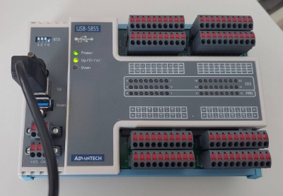
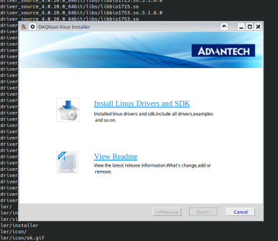
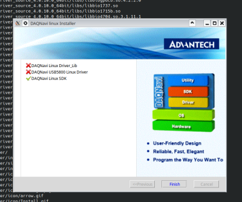
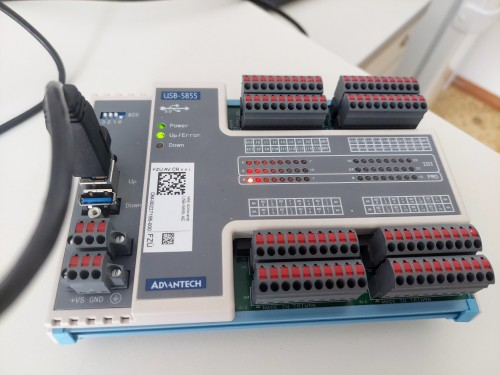

# Advantech USB-5855 IO board control in recent Ubuntu

{.align-center}

Advantech USB-5855 IO card is 

> 32-ch Isolated Digital Input and 16-ch PhotoMOS Relay USB 3.0 I/O Module ^[2]^

### Installation of vendor driver and daemon

Installer can be downloaded from 

https://www.advantech.com/en/search/?q=USB-5855&st=support as "DAQNavi Driver for Linux".

Run it in terminal as root or with `sudo`:

```
$ sudo ./DAQ_Linux_4.0.10.0_64bit.run
```
Installer window shows.

{.align-center}

in installer window, click on "Install...", default install path (`/opt/advantech`) is fine. In driver selection, keep only:
* DAQNavi Linux SDK
* DAQNavi Linux Drivers
* DAQNavi USB5800 LinuxDriver

click next. Most likely, compilation of base driver library, and specific device driver will fail with X sign:

{.align-center}

this is hint that we need to look better at kernel module compilation.

### Patching source code of driver

Vendor claims support for quite old version of Ubuntu kernel. 

#### Modification of `biokernbase.ko` generic driver module


Attempting to manually build base driver library ( `make` ) in 

```
/opt/advantech/daqnavi_driver_source_code/linux_driver_source_4.0.10.0_64bit/drivers/driver_lib/src/kern/linux
```

reveals, that driver expects `class_create()` API call to accept two arguments, what is not true^[1]^ in current (14.2.2024) kernel. Quick inspection of kernel source reveals, that it should be enough to replace line

```
daq_class = class_create(THIS_MODULE, "daq");
```

with

```
daq_class = class_create("daq");
```

`$ make` and `# make install` should work now.

Result of this build is:

* `biokernbase.ko`
* `/etc/udev/rules.d/71-bionic-daq.rules`

#### Build of device-specific driver for USB-5855

By running 

```
grep '5855' -r .
```

In top `/opt/advantech` we see that our device is supposed to be supported by driver in `drivers/usb5800dio` subdirectory. 

In particular dir, do `make` and `make install`.

Result is `bio5800dio` , no patches were needed.

### Testing device

Now it's possible plug-in USB-5855 USB cable into our computer. In dmesg one can see:

```
[ 2321.197527] ****Advatech USB device descriptor:
[ 2321.197531] --------bNumConfigurations: 1; bcdUSB: 310;
[ 2321.197533] --------idVendor: 1809; idProduct: 5855 ;
[ 2321.197535] --------bcdDevice: 0; bMaxPacketSize0: 9
[ 2321.197536] set pipe#0[addr:0x2] stream size: 32
[ 2321.197610] set pipe#1[addr:0x82] stream size: 32
[ 2321.197689] set pipe#2[addr:0x5] stream size: 512
[ 2321.197768] set pipe#3[addr:0x85] stream size: 512
...
[ 2321.198306] --> board_id = 1 fw_ver = 0x104, pld_ver = 0x0, ret=32
```

Using test utilities, verify that we can see our device:

```
cd /opt/advantech/daqnavi_driver_source_code/linux_driver_source_4.0.10.0_64bit/tools
```

#### testing with `dndev`:

```
# ./dndev 
DAQNavi devices list in system:
0,USB-5855,BID#1
# 
```

#### testing `device_enum`:

```
# ./dev_enum 
+---------+---------------+-------------------------------+
| No.#    | Device Number | Device Description            |
+---------+---------------+-------------------------------+
| 0       | 0             | USB-5855,BID#1                |
+---------+---------------+-------------------------------+
| Total: 1 devices                                        |
+---------+---------------+-------------------------------+
#
```

#### Blinking LED with Python SDK example

cd to Python example directory:

```
cd /opt/advantech/daqnavi_driver_source_code/linux_driver_source_4.0.10.0_64bit/examples/Python/DO_StaticDO
```

and modify `staticDO.py` in this way:

* patch string `deviceDescription` to match device name printed by dndev above so in our particular case to: `deviceDescription = "USB-5855,BID#1"`

now we can try to light up first LED in port0 by running te example and submitting `1` as the value.

```

# python3 ./staticDO.py 
Input a 16 hex number for D0 port 0 to output(for example, 0x00): 1
DO output completed!
#
```

if first LED is on, as at picture below, everything went correctly and we're done.

{.align-center}

Because of how integers are internally represented, interesting value to test is `-1`. The python script is very transparent, and it can be easily patched to use CLI command arguments instead of interactive dialog:


<p>
  <center>
<video controls autoplay width="600">
  <source src="/other-videos/advantech-usb-5855.webm" type="video/webm" >
  Your browser does not support the video webm tag.
</video> 
  </center>
</p>

### Notes

#### issue with secure boot

Modern Linux distributions enforce security consistency by validating cryptographic signatures of kernel and kernel modules. Indeed this tutorial doesn't cover this topic as we only compiled `*.ko` files.

If your system enforces kernel module signing, one can disable that using `mokutil --disable-validation`. (reboot and re-typing of temporary secret in GRUB needed)

In case of dual-boot with certain proprietary non-UNIX system, their security device validation procedure might fail, and manual type-in of backup security keys might be needed.

### Components of SW

#### DAQNavi4 Device Monitor Daemon

started as systemd service by

```
/lib/systemd/system/daqnavi_daemon.service
```

runs `/opt/advantech/daqnavi_daemon/daqnavi_daemon`

the full functionality is not yet understood. Analysis of system calls issued by this daemon reveals, that it attempts to interact with ```/var/lib/daq/daqnavi.config.db```, most SQLite3 config database file used by this binary.

#### Udev rule file

placed in 

```
/etc/udev/rules.d/71-bionic-daq.rules
```

triggers run of `daqnavi_daemon` when device is plugged-in.

#### Character devices `/dev/daq0` and `/dev/daq255`

created by driver, reprenent device in dev tree.

#### SQLite3 database `daqnavi.config.db` 

located by default in `/var/lib/daq`. When removed, breaks the funcionality of Python SDK.
Contains both static and run-time variables of system, eg here we can see the information about USB connectivity of our device:

```
# sqlite3 daqnavi.config.db 
SQLite version 3.42.0 2023-05-16 12:36:15
Enter ".help" for usage hints.
sqlite> select * from device_map;
0|2087|1|0|1|0|3|bio5800dio|/dev/daq0|USB-5855,BID#1|||/USB/usb-0000:05:00.3-1.2.4.1
sqlite>
#
```

### Troubleshooting

1) read logs to figure out what's wrong
2) fix that :)

## References

^[1]^ https://www.kernel.org/doc/html/v6.5/driver-api/infrastructure.html#c.class_create
^[2]^ https://www.advantech.com/en-eu/products/1-2mlkno/usb-5855/mod_69395467-3fd1-4851-a8a5-60b30462a26b
