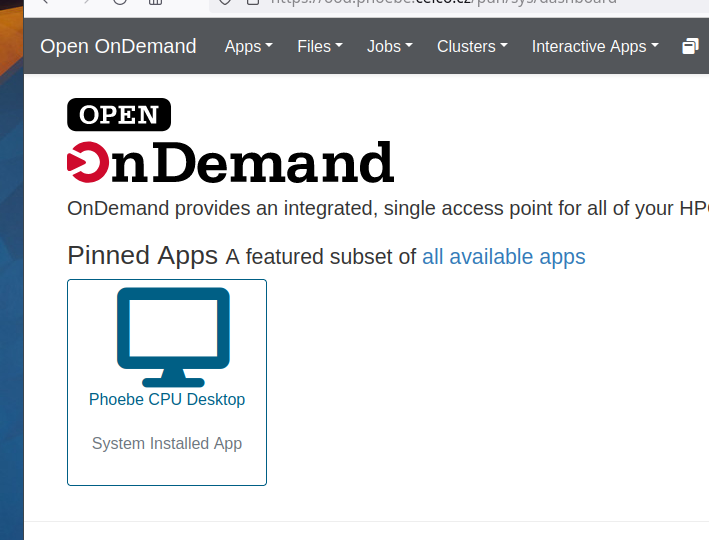
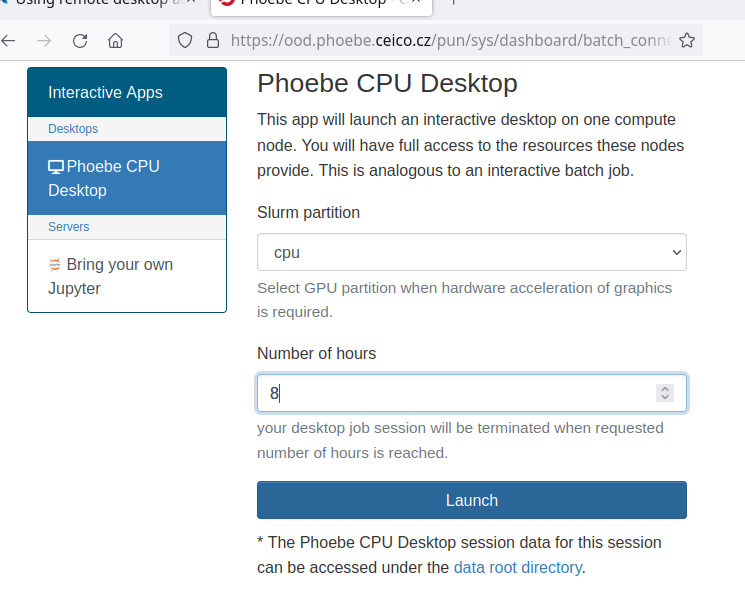
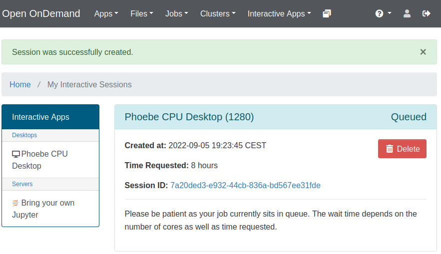

# Remote desktop in Open OnDemand

Open a graphical Linux desktop running on a Phoebe compute node in your browser, for example
to use [Wolfram Mathematica](../../software/mathematica/index.md). First
[log in to Open OnDemand](index.md#log-in).

## Start a desktop session

Click the **Phoebe CPU Desktop** icon.

In the form, set how many hours the session may run (e.g. 8) and click **Launch**. This submits
the desktop session as a job to Slurm.

## Wait for the job to start

The session is first shown as **Queued**, with a light blue header.

## Open the desktop

When Slurm has found resources, the header turns green and a blue **Launch Phoebe CPU Desktop**
button appears. Set both **Compression** and **Image Quality** to 9 (the highest) for the
sharpest picture, then click the button. The desktop opens in a new browser tab.

To come back to the session later or end it, see
[reconnect](index.md#reconnect-to-a-running-session) and [end a session](index.md#end-a-session).
