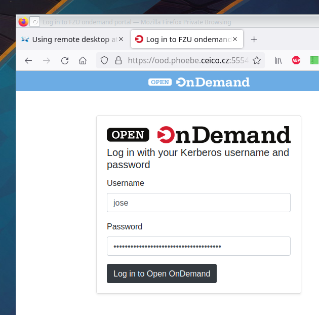

# Open OnDemand

Open OnDemand (OOD) is a web portal for interactive work on Phoebe. You can start a
[JupyterLab](jupyterlab.md) or a [remote desktop](desktop.md) session from any browser on
Linux, macOS or Windows. A session is a Slurm job on a compute node: it keeps running when you
close the browser, until you end it or its time runs out.

## Two portals

Phoebe has two Open OnDemand portals with the same apps:

| Portal | Address | Reachable from | Sign in with |
| --- | --- | --- | --- |
| Internal | [ood.phoebe.ceico.cz](https://ood.phoebe.ceico.cz) | FZU network or FZU VPN | your FZU "Kerberos" username and password |
| External | [ext.phoebe.fzu.cz](https://ext.phoebe.fzu.cz) | anywhere | a passkey, see [set up a passkey](../passkey.md) |

From outside the FZU network, the internal portal shows the page "This service is available
only from the FZU network" (HTTP 403). Connect to the VPN, or use the external portal.

A short [screencast of a Phoebe remote desktop session](https://www.youtube.com/watch?v=TYqsTua9f2M)
is on YouTube.

## Log in

On the **internal portal**, go to [https://ood.phoebe.ceico.cz](https://ood.phoebe.ceico.cz) and
log in with your FZU "Kerberos" username (typically the part of your e-mail address before `@`)
and the same password you use for web mail.

On the **external portal**, go to [https://ext.phoebe.fzu.cz](https://ext.phoebe.fzu.cz). It sends
you to the sign-in page at `id.phoebe.fzu.cz`, where you sign in with your passkey.

## Reconnect to a running session

Log in to the portal. In the top menu, click **My Interactive Sessions**. On a narrow screen it is
shown only as an icon:

=== "Narrow screen"

    

=== "Wide screen"

    

Each running session has a card with a button to open it again, for example **Launch Phoebe
CPU Desktop** or **Connect to Jupyter**. The session opens in a new browser tab.

## End a session

Every running session holds cluster resources that others could use. When you are done, go to
**My Interactive Sessions** and click the red **Delete** button on the session's card.
