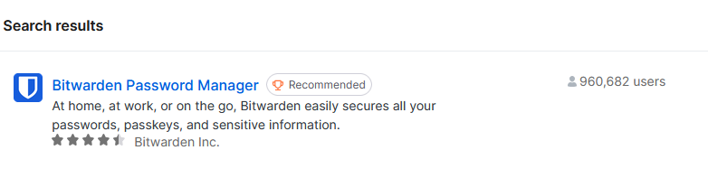
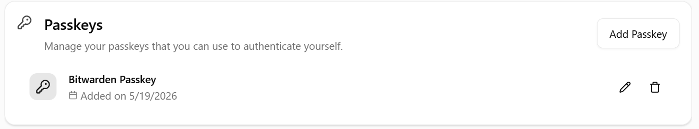

# Set up a passkey for the Phoebe portal

A passkey lets you sign in to the Phoebe portal without requesting a new one-time login link
each time. This guide stores the passkey in Bitwarden in Firefox.

!!! warning "TODO"
    Name the portal this page is about and give its URL. It is not the Open OnDemand portal,
    which uses your FZU Kerberos password.

**Before you start**

- For your first Phoebe login, an administrator will send an invitation link or login code by
  e-mail.
- The invitation link or code can be used only once. Keep that browser tab open until you have
  finished setting up the passkey.

## 1. Install Bitwarden in Firefox

Open the Firefox add-ons site, search for **Bitwarden Password Manager**, and install the
extension.

Open the Bitwarden extension and sign in to your existing Bitwarden account. If you do not have
an account yet, create one first.

## 2. Open the passkey settings

After your first login, open your account information. In the **Passkeys** section, select
**Add passkey**.

## 3. Save the passkey in Bitwarden

Bitwarden should open a pop-up asking to save the passkey. Confirm the prompt to continue.

/// caption
Bitwarden passkey prompt
///

## 4. Name and confirm the passkey

You may give the passkey a recognizable name. The default name is "Bitwarden Passkey". Confirm
the creation and check that the new passkey appears in your account settings.

/// caption
Naming the passkey
///

/// caption
Saved passkey
///

## 5. Sign in with the passkey

On later visits, select **Authenticate**. Bitwarden will offer the saved passkey; choose it to
sign in. Bitwarden may ask for your vault master password after the device has been locked.

