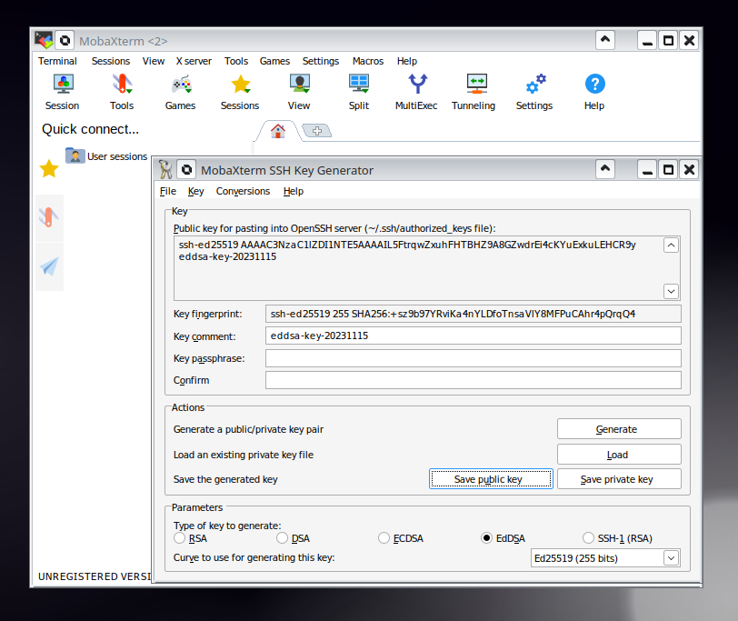

# Create an SSH key pair

Phoebe and Koios accept only SSH key logins. A key pair has two parts: a **private** key that
stays on your computer, and a **public** key that you send to the administrators.

=== "Linux / macOS"

    If you do not have an SSH key pair yet, open a terminal and run:

    ```bash
    ssh-keygen -t ed25519
    ```

    `ssh-keygen` then asks two questions:

    1. **Enter file in which to save the key**: press ++enter++ to accept the default
       location (`~/.ssh/id_ed25519`).
    2. **Enter passphrase**: type a [strong passphrase](https://en.wikipedia.org/wiki/Passphrase)
       and repeat it. If your disk is encrypted, you may leave it empty and just press
       ++enter++ twice.

    ??? example "Example output"

        ```text
        Generating public/private ed25519 key pair.
        Enter file in which to save the key (/home/testuser/.ssh/id_ed25519):
        Created directory '/home/testuser/.ssh'.
        Enter passphrase (empty for no passphrase):
        Enter same passphrase again:
        Your identification has been saved in /home/testuser/.ssh/id_ed25519
        Your public key has been saved in /home/testuser/.ssh/id_ed25519.pub
        The key fingerprint is:
        SHA256:SLKcljiOmsdTubEGeG+6QP+nDs0NoLciBA71guz8BXQ testuser@hostname
        The key's randomart image is:
        +--[ED25519 256]--+
        |  .. E           |
        |.o...            |
        |+..oo .          |
        |* .+o* .         |
        | Oo.*+. S        |
        |+o*oO o          |
        |++.O * .         |
        |oo= O  .         |
        |o.o*.+o          |
        +----[SHA256]-----+
        ```

    Print your **public** key and send it to the CEICO HPC administrator:

    ```bash
    cat ~/.ssh/id_ed25519.pub
    ```

    !!! warning
        Never share the private key `~/.ssh/id_ed25519` (the file without `.pub`).

=== "Windows (MobaXterm)"

    Install [MobaXterm](https://mobaxterm.mobatek.net/download.html), a terminal for Windows
    with a built-in SSH client, then:

    1. Click **Tools** → **MobaKeyGen**.
    2. Choose the key type **EdDSA** (Ed25519).
    3. Click **Generate** and move your mouse over the blank area to generate some randomness.
    4. Type a strong passphrase into **Key passphrase** and repeat it in **Confirm passphrase**.
    5. Click **Save private key** and save it somewhere safe (e.g. your home directory). The
       file has the extension `.ppk`.
    6. Copy the **Public key for pasting into OpenSSH server** field and send it to the CEICO
       HPC administrator (e.g. by e-mail or Slack).

    

    !!! warning
        Never share the private key file (`.ppk`).

Next: [request an account](account.md) with your public key.
