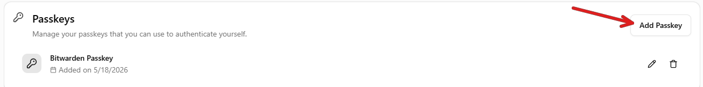
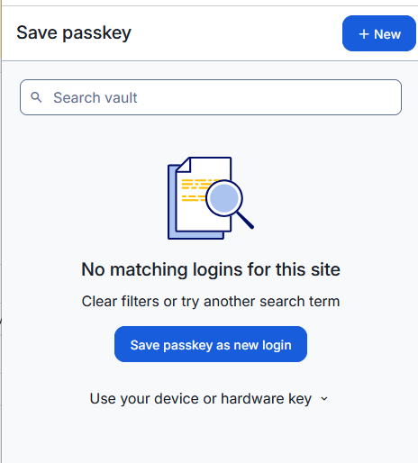
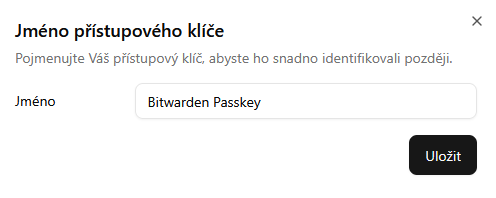
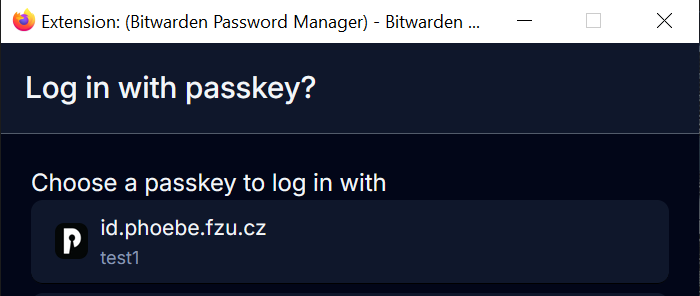

# Set up a passkey for the Phoebe portal

A passkey lets you sign in to the Phoebe portal without requesting a new one-time login link each time. This guide uses Bitwarden in Firefox.

**Before you start**

- [Install Bitwarden in Firefox](passkeys/bitwarden.md) and sign in to your Bitwarden account.
- For your first Phoebe login, an administrator will send an invitation link or login code by email.
- The invitation link or code can be used only once. Keep that browser tab open until you have finished setting up the passkey.

**1. Open the passkey settings**

After your first login, open your account information. In the **Passkeys** section, select **Add passkey**.

**2. Save the passkey in Bitwarden**

Bitwarden should open a pop-up asking to save the passkey. Confirm the prompt to continue.

{ style="width:41.15%" }

*Bitwarden passkey prompt*

**3. Name and confirm the passkey**

You may give the passkey a recognizable name. The default name is "Bitwarden Passkey". Confirm the creation and check that the new passkey appears in your account settings.

*Naming the passkey*

*Saved passkey*

**4. Sign in with the passkey**

On later visits, select **Authenticate**. Bitwarden will offer the saved passkey; choose it to sign in. Bitwarden may ask for your vault master password after the device has been locked.

