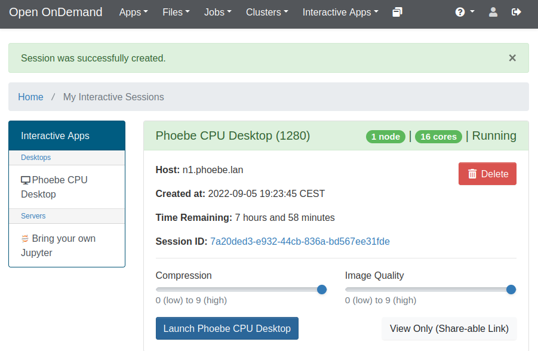
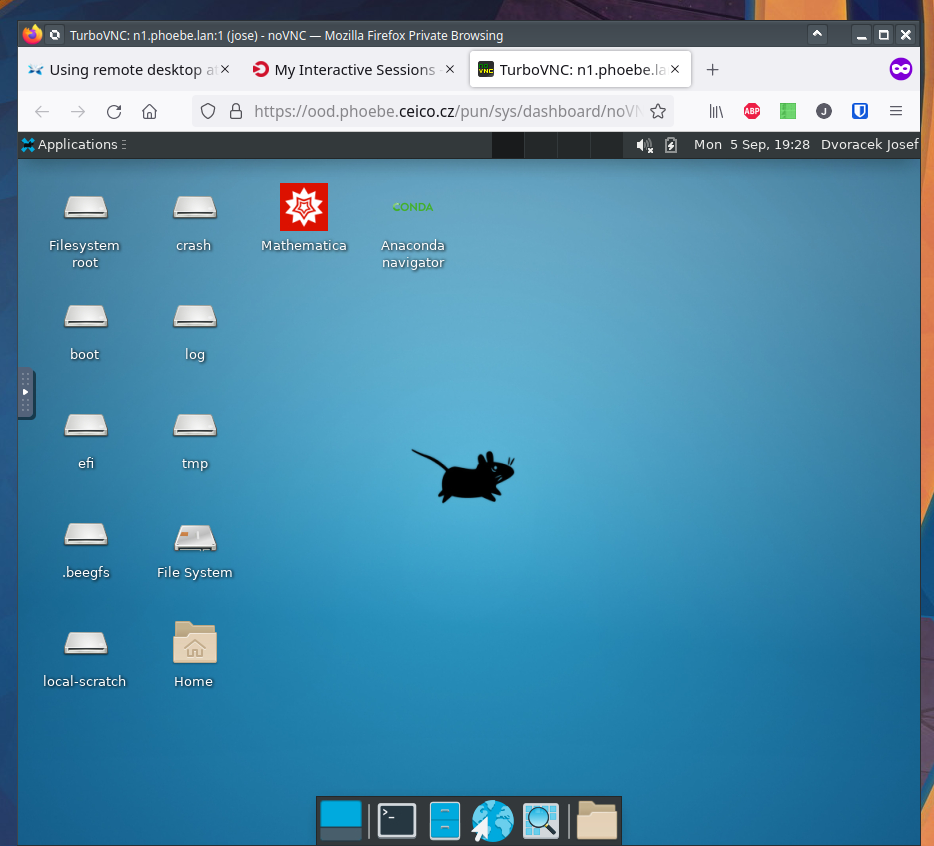
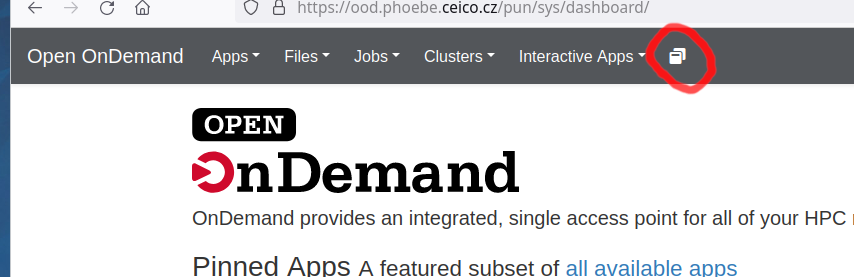
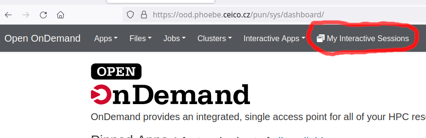
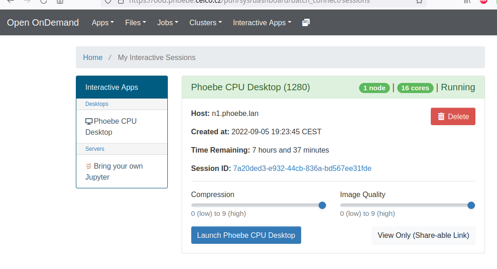

# Using remote desktop at Phoebe

Open OnDemand (OOD) is a web portal that simplifies access to high-performance computing (HPC) resources. It provides a user-friendly interface for managing files, submitting jobs, and accessing various HPC tools.

Open OnDemand sessions refer to interactive computing sessions initiated through the Open OnDemand web portal. These sessions are typically used for interactive and on-the-fly analysis, providing users with direct access to the high-performance computing (HPC) resources of our clusters. The Open OnDemand sessions are running on compute nodes allocated by the HPC system specifically for interactive use.

In first chapter we describe starting new session, in the second one how to connect to existing session.

-   [:link: Phoebe Remote Desktop screencast at YouTube](https://www.youtube.com/watch?v=TYqsTua9f2M) 

## 1 How-to: starting new session

!!! warning "Important"
    most of Phoebe services are available from Institute networks or VPN only

### 1.1 Ondemand portal log-in

go to [https://ood.phoebe.ceico.cz](https://ood.phoebe.ceico.cz) and login with your Institute “Kerberos” login (your username is typically the word before `@` in your email) and your password is same you're using for webmail access.

### 1.2 Start new Desktop session

Click on icon “Phoebe CPU Desktop”

### 1.3 Set Desktop deadline

In following dialog, select Deadline for the new desktop session in hours. (eg. 8) and click on "Launch" button.  
This will submit the Desktop job to scheduler.

### 1.4 submitting Desktop session to scheduler

After submitting job, we can see Desktop job as "**Queued**" with light blue header.

### 1.5 Accessing newly started session

Once scheduler finds proper resources for your Desktop, header of job greens, and blue button "Lauch..." appears.

I recommend to set both Compression and Image Quality to "9" (the highest) and click on "Launch..." button.  
In new tab of browser should be opened remote desktop at Phoebe cluster.

## 2 How-to: Reconnect to already running session

As described above, login to the OnDemand portal at [https://ood.phoebe.ceico.cz](https://ood.phoebe.ceico.cz) with your Kerberos username/password. Then, depending on your display resolution, in the top-menu, you should see either "My Interactive Sessions" menu item, or only corresponsing icon. Click on it..

=== "view on narrower screen"

    

=== "view on wide screen"

    

    ..click on "Launch Phoebe CPU Desktop" and your session will be reopened in new tab of browser.

    

## 3 How-to: End running session

Every running session is consuming part of cluster resources. So after finishing your work, in "My Interactive Sessions" click on red "Delete" button.
