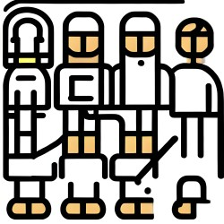

# Getting an user account at Phoebe system

First create fresh ssh keypair.

-   [Create SSH keypair at Linux/Mac](../getting-a-user-account/create-ssh-keypair-nix.md)
-   [Create SSH keypair in Windows using MobaXterm](../getting-a-user-account/create-ssh-keypair-win.md)

..and then just visit/message [Josef](https://www.fzu.cz/lide/ing-josef-dvoracek) and he'll do all the necessary steps with you. 

