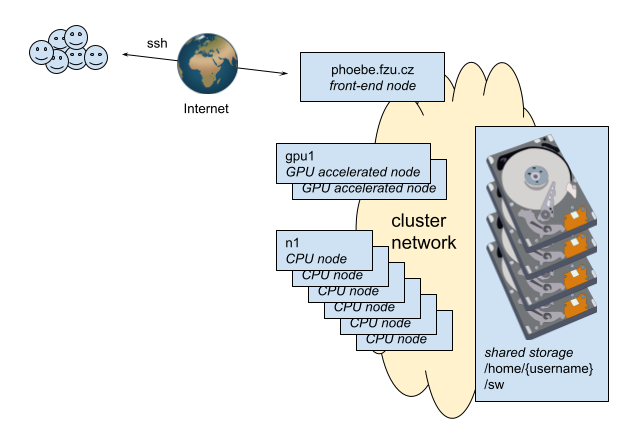

# Accessing Phoebe using SSH (command line interface)

## SSH host key fingerprints
* **phoebe** ED25519 key fingerprint:  `SHA256:xy6+Upes9O4LWWQkME7TjWsmotoTOMlZMSBBWg+j2Zk`

* **koios1** ED25519 key fingerprint:  `SHA256:iIOuILdupxCyIhkFKNjlsRP1hs/cFHvuBKu9XF8HVFQ`
* **koios2** ED25519 key fingerprint:  `SHA256:iwY/4d72sj+3KK5Mh5NgpcqJangwPK5GAIUYTm5i7Hw`

## Connect from your system

-   [:penguin: SSH session from Linux](ssh/linux.md)
-   [:apple: SSH session from MAC](ssh/mac.md)
-   [:computer: SSH session from Windows](ssh/windows.md)

