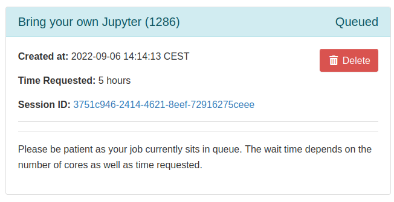
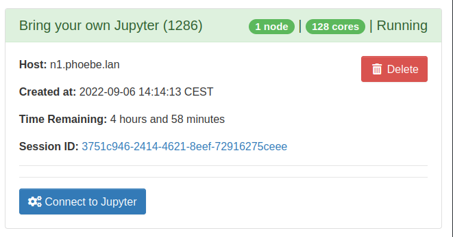

# Using JupyterLab via Ondemand Portal at Phoebe system

OnDemand is portal offering interactive work with Phoebe supercomputer. It's easy to use from any enviroment - Linux, Mac, or even Windows. Interactive session, once started, runs at the cluster, even if a browser is closed and user disconnected.

!!! warning "Important"
    most of Phoebe services are available from Institute networks or VPN only

## 1.1 Ondemand portal log-in


go to [https://ood.phoebe.ceico.cz](https://ood.phoebe.ceico.cz) and login with your Institute “Kerberos” login (your username is typically the word before `@` in your email) and your password is same you're using for web-mail access.

## 1.2 Python usage concept

Python itself is provided through Lmod modules. User-required packages are installed within isolated Python virtual environments, which must also include JupyterLab.

## 1.3 Quick start

* Go to https://ood.ceico.cz
* select "VENV-based JupyterLab"
* **Slurm partition**: select cpu, or choose gpu if you require GPU acceleration
* **Preloaded moduleset**: keep empty.
* **Python version**: Select the version you need, typically the latest one.
* **Session duration:**  - select what you want.
* **Instance size** - amount of cpu cores
* **GPU count** left 0 if you don't need any GPU
* **Venv name to be created in ~/.venvs/** - select name of virtual environment. Most likely you want to 
* **Existing venv path to use** : keept empty, work in progress :)

→ Click on <kbd>Launch</kbd> button - this will submit the Jupyter session job to scheduler.

## 1.4 Wait for job launch

Especially for the first time, start of job, and related creating of initial conda environment can take some time. The session will be first in state <kbd>Queued</kbd>:



## 1.5 Connect to the launched session

Once the session is in <kbd>Running</kbd> state, click on <kbd>Connect to Jupyter</kbd> button. In the new tab of browser, Jupyter session will appear.



## 2 How-to: Reconnect to already running session

As described above, login to the OnDemand portal at [https://ood.phoebe.ceico.cz](https://ood.phoebe.ceico.cz) with your Kerberos username/password. Then, depending on your display resolution, in the top-menu, you should see either "My Interactive Sessions" menu item, or only corresponsing icon. Click on it..


=== "view on narrower screen"


    

=== "view on wide screen"


    

    ..click on "Launch Phoebe CPU Desktop" and your session will be reopened in new tab of browser.

    

## 3 How-to: End running session

Every running session is consuming part of cluster resources. So after finishing your work, in "My Interactive Sessions" click on red "Delete" button.
```
