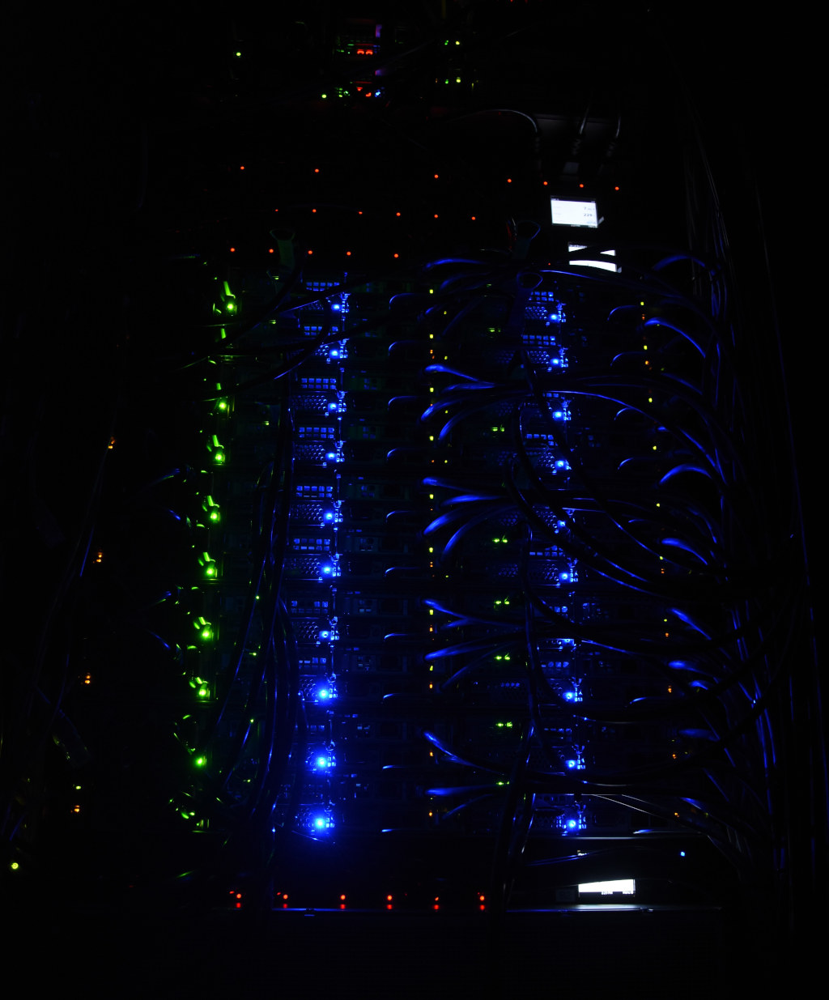
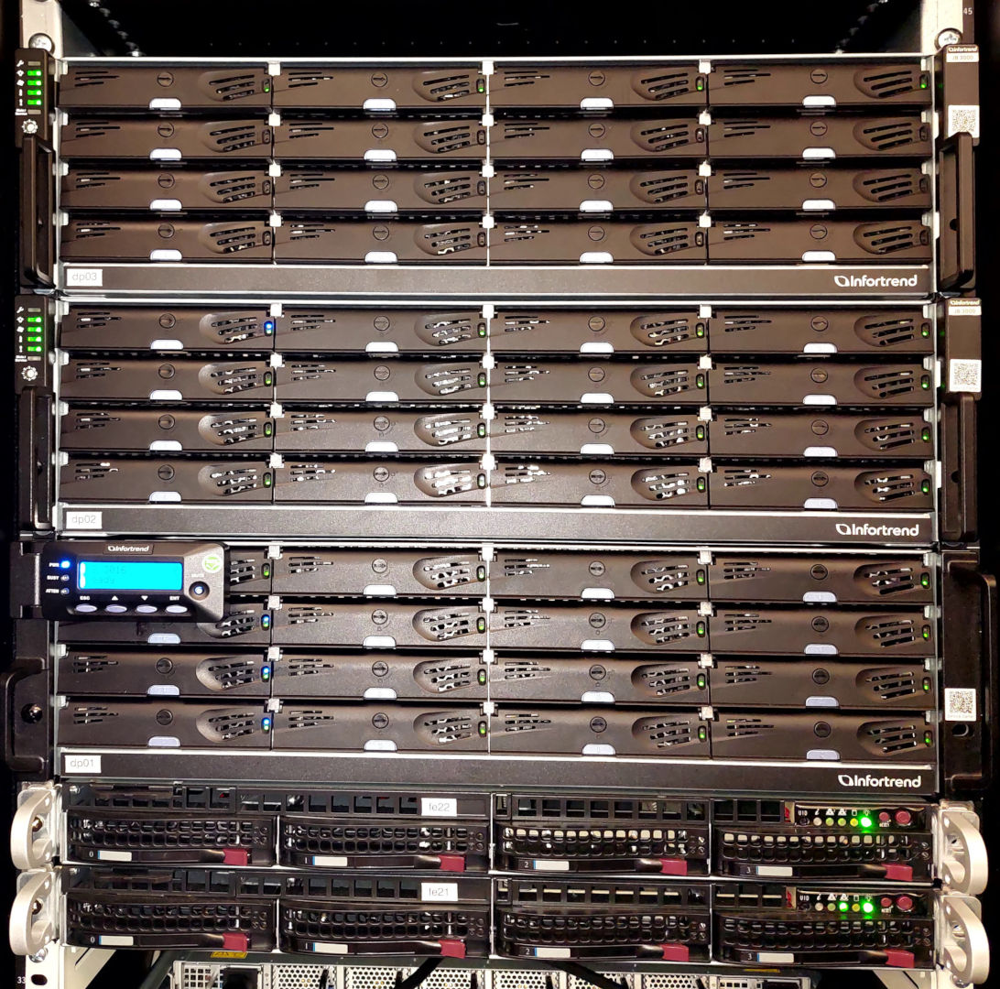
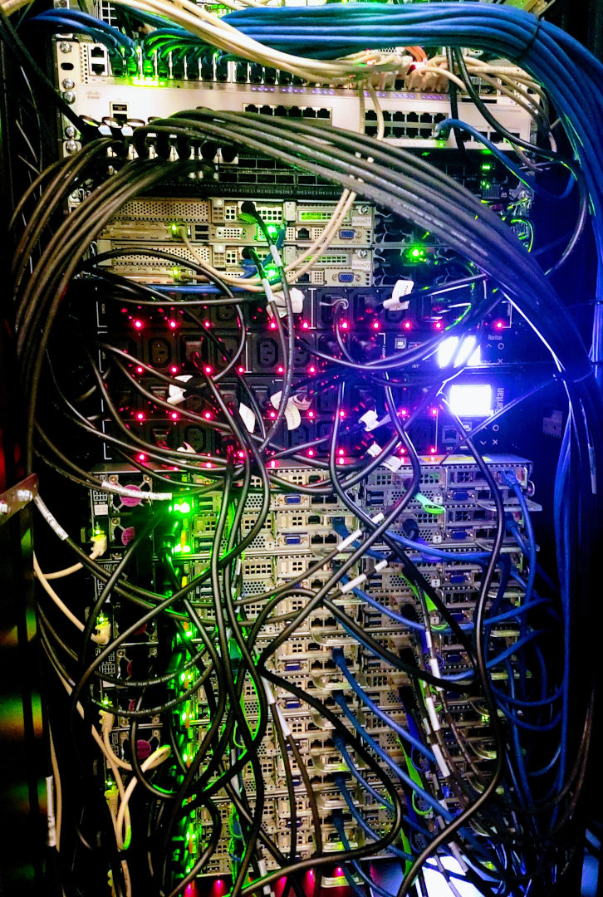
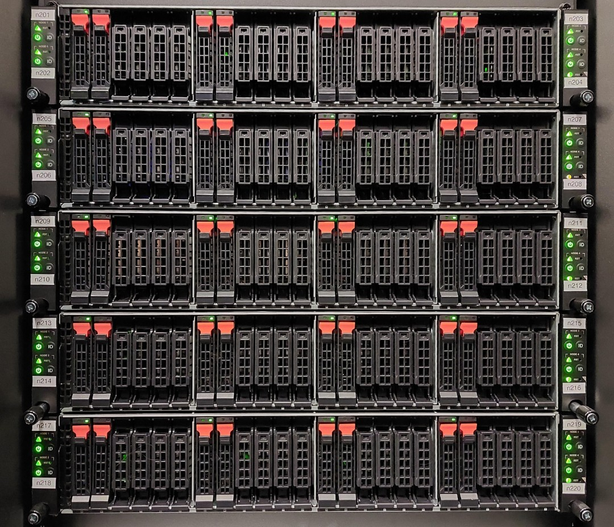

# Phoebe HPC cluster

Phoebe is the high-performance computing cluster of CEICO at the Institute of Physics (FZU) of the
Czech Academy of Sciences. This site explains how to get an account, connect, and run your work.

[Get an account](getting-there/getting-a-user-account.md){ .md-button .md-button--primary }
[Connect with SSH](getting-there/ssh.md){ .md-button }

-   **1344** CPU cores
-   **16** NVIDIA A100 GPUs
-   **2 TB** RAM per GPU node
-   **218 TB** shared storage
-   **100 Gb/s** InfiniBand

## Start working

-   :material-account-plus:{ .lg } **Get an account**

    ---

    Create an SSH key pair, then contact the Phoebe administrator to set up your account.

    [:octicons-arrow-right-24: Account setup](getting-there/getting-a-user-account.md)

-   :material-console:{ .lg } **Command line (SSH)**

    ---

    Log in to the front-end node `phoebe.fzu.cz` from Linux, macOS or Windows.

    [:octicons-arrow-right-24: Connect with SSH](getting-there/ssh.md)

-   :material-language-python:{ .lg } **JupyterLab in the browser**

    ---

    Run Python notebooks on the cluster through the Open OnDemand portal.

    [:octicons-arrow-right-24: Start JupyterLab](getting-there/using-jupyterLab-at-ondemand.md)

-   :material-monitor:{ .lg } **Remote desktop**

    ---

    Use graphical applications such as Wolfram Mathematica in a desktop session.

    [:octicons-arrow-right-24: Open a desktop](getting-there/desktop.md)

!!! warning "Network access"
    Most Phoebe services are available only from Institute networks or over VPN.

## Run your work

-   [:material-tray-arrow-up: **Submit a batch job**](submit-job.md)

    Write a Slurm job script and queue it.

-   [:material-timer-play-outline: **Interactive session**](slurm/interactive_slurm_cli_session.md)

    Get a shell on a compute node for testing and debugging.

-   [:material-bug-outline: **Troubleshoot a job**](slurm/slurm_jobs_troubleshooting.md)

    Find out why a job failed or is still waiting.

-   [:material-package-variant: **Software modules**](useful/module_use.md)

    Load compilers, libraries and applications with Lmod.

## About the system

Phoebe consists of 20 compute nodes, each with 64 CPU cores (2× AMD EPYC 7543[^amd_7543]),
512 GB of RAM and 1.7 TB of fast local NVMe[^wiki_NVME] disk. Two additional *"fat"* GPU nodes
each carry 8 NVIDIA A100[^nvidia_A100] cards, 2 TB of RAM and 3.4 TB of local NVMe storage.

Software, user and project data are stored on 218 TB of hybrid storage built from both solid
state and rotational drives. All components are connected by a low-latency 100 Gbit
InfiniBand fabric.

| pcs | hostnames | resource | n~cores~ | f~cpu~ (base) | f~cpu~ (max) | RAM | local storage | notes |
| --- | --- | --- | --- | --- | --- | --- | --- | --- |
| 20  | `n[1-20]` | CPU compute nodes | 64  | 2.8 GHz | 3.7 GHz | 512 GB | 1.7 TB |  -   |
| 2   | `gpu[1-2]` | GPU-accelerated *fat* nodes | 64  | 2.8 GHz | 3.7 GHz | 2 TB | 3.4 TB | 8× NVIDIA A100 |
| 1   | `phoebe.fzu.cz` | login front-end node | 48  | 3.5 GHz | 4.0 GHz | 368 GB | -  |  -   |

More detail: [Phoebe hardware](hardware.md).

### Pictures from the datacenter

/// caption
Status LEDs in the dark server room
///

/// caption
Disk shelves and storage servers
///

/// caption
Power, Ethernet and InfiniBand cabling
///

/// caption
Compute nodes, front view
///

### About the name

{ .plain .off-glb align=right width=140 }

In Greek mythology, Phoebe (*ˈfiːbi*), sister of Κοῖος (Koios), was one of the first
generation of Titans, the sons and daughters of Uranus and Gaia.[^wiki_Phoebe]
Koios is also the name of our [previous cluster](koios.md).

[^amd_7543]: [AMD EPYC™ 7543, vendor product page](https://www.amd.com/en/products/cpu/amd-epyc-7543)
[^wiki_NVME]: [Wikipedia: NVMe](https://en.wikipedia.org/wiki/NVM_Express)
[^nvidia_A100]: [NVIDIA A100, vendor product page](https://www.nvidia.com/en-us/data-center/a100/)
[^wiki_Phoebe]: [Wikipedia: Phoebe (Titaness)](https://en.wikipedia.org/wiki/Phoebe_(Titaness))
