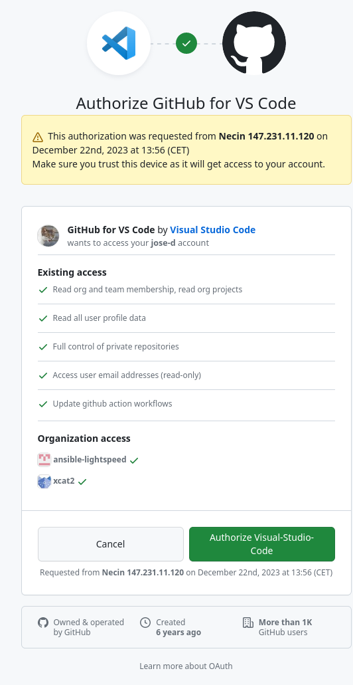

# VS Code remote tunnel on Phoebe

## Prepare your workstation

- make sure you have working [github.com](http://github.com) account
- Install vscode at your workstation/laptop.  [Installers are available](https://code.visualstudio.com/) for most Linux distributions, MacOS, and Windows.
- At vscode, install  [Remote Development extension pack](https://marketplace.visualstudio.com/items?itemName=ms-vscode-remote.vscode-remote-extensionpack)

## Log in to Phoebe using SSH

```text
jose@jose-t14s:~$ ssh phoebe.fzu.cz -l jose
Welcome at CEICO (www.ceico.cz) computing facilities :)
Last login: Fri Dec 22 13:30:38 2023 from phoebe-gw.fzu.cz
[jose@login1 ~]$
```

## Download and unpack the VS Code CLI (first use only)

Download:

```text
curl -Lk 'https://code.visualstudio.com/sha/download?build=stable&os=cli-alpine-x64' --output vscode_cli.tar.gz
```

Unpack:

```text
tar -xf vscode_cli.tar.gz
```

Verify you see unpacked binary:

```text
$ ls -1
code
vscode_cli.tar.gz
$
```

Good, we see the `code` binary aavailable in current directory.

## Start `screen` or attach to an existing screen session

In this example we start new `screen` session named "tunnel".

```text
[jose@login1 ~]$ screen -S tunnel
```

- Screen automatically connects to newly created session.

Inside of the screen, type-in this snippet.

```text
srun --part=gpu_int --job-name "code_tunnel" --gres=gpu:a100:1 --cpus-per-task=16 --mem=128G --time=24:00:00 --pty ./code tunnel --name "Phoebe" --accept-server-license-terms
```

This snippet created job limited by walltime 24hours, requesting one A100 GPU with tunnel name "Phoebe".

## Start the remote VS Code instance

Navitage trough following dialog, log in using your github account:

```text
[jose@login1 codetunnel]$ srun --part=gpu_int --job-name "code_tunnel" --gres=gpu:a100:1 --cpus-per-task=16 --mem=128G --time=24:00:00 --pty ./code tunnel --name Phoebe --accept-server-license-terms 
srun: job 1426008 queued and waiting for resources
srun: job 1426008 has been allocated resources
*
* Visual Studio Code Server
*
* By using the software, you agree to
* the Visual Studio Code Server License Terms (https://aka.ms/vscode-server-license) and
* the Microsoft Privacy Statement (https://privacy.microsoft.com/en-US/privacystatement).
*
✔ How would you like to log in to Visual Studio Code? · Github Account
To grant access to the server, please log into https://github.com/login/device and use code ABCD-ABCD
```

visit the URL offered by script - typically device login page <https://github.com/login/device>, and type-in security code.



## Connect from your local VS Code

Once you've authorized vscode app, you can connect from your local vscode to registered tunnel:

<video controls preload="metadata">
  <source src="../screenshots/untitled.webm" type="video/webm">
</video>
