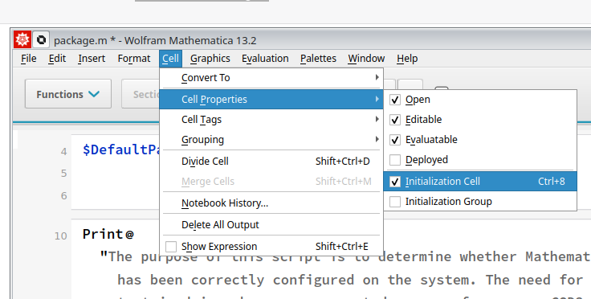

# Wolfram Mathematica on Phoebe

## Licenses

Our Wolfram license server is available from FZU neworks at `license.ceico.cz` - at the same URL the current utilization numbers are available - [https://license.ceico.cz/](https://license.ceico.cz/). Please refrain from using multiple Mathematica instances simultaneously, as we have a limited number available..


## Interactive (Desktop) use

Follow the [procedure outlined here](../../getting-started/ondemand/desktop.md) and effortlessly launch Wolfram Mathematica using the desktop icon. Yes, it's that straightforward.

## Batch (non-interactive) use

"One viable approach is to create a Mathematica Package File (distinct from a Wolfram Package file(!)) and submit it using a Slurm batch file.

### Create a Mathematica package (`*.m`) file from a notebook

1. Choose the cells within the Mathematica Notebook, and proceed by following the instructions, clicking on `Cell` > `Cell Properties` > `Initialization Cell`. This will allow you to configure the selected cells to be included in the package.



2. To generate the batch file, follow these steps: click on `File` > `Save As`> `Wolfram Mathematica Package (*.m)` in the menu bar.

3. Look for Mathematica versions available and load its module

use `module spider Mathematica`:

```
[user@node ~]# module spider Mathematica

-------------------------------------------------------------------------------------------------------------------------------
  Mathematica:
-------------------------------------------------------------------------------------------------------------------------------
    Description:
      Mathematica is a computational software program used in many scientific, engineering, mathematical and computing fields.

     Versions:
        Mathematica/11.3.0
        Mathematica/12.0.0
        Mathematica/13.1.0
        Mathematica/14.1.0
```
and load selected Mathematica version:

`module load Mathematica/14.1.0`


4. Run package - `math` binary should be able to execute our module in non-interactive mode:

```
math -run < package.m 
...
```

### Create the sbatch job file

To run our mathematica module on cluster, we need to create slurm sbatch file, describing time constraints and resource requirements to slurm job manager. 

So create textfile eg. `sbatch_mathematica.sh` containing:

```
#!/bin/bash
#SBATCH --job-name=wolframTest
#SBATCH --time=33:33:33
#SBATCH --partition=cpu
#SBATCH --ntasks=1
#SBATCH --cpus-per-task=64

echo "sbatch-INFO: start of job"
echo "sbatch-INFO: nodes: ${SLURM_JOB_NODELIST}"
echo "sbatch-INFO: system: ${SLURM_CLUSTER_NAME}"

module load Mathematica/14.1.0

math -run < package.m 

echo "sbatch-INFO: we're done"
date
```

#### sbatch file hints

* use descriptive `--job-name`, but do not use whitespaces
* Attempt to accurately estimate the time (`--time`)required for your task. Setting a value too low may result in premature termination of your application, while setting it too high could lead to suboptimal scheduling. In general, erring on the side of overestimating time constraints is preferable to underestimating, as it ensures a safer and more reliable execution.
* If your application utilizes parallelization techniques such as `ParallelDo`[^docu^](https://reference.wolfram.com/language/ref/ParallelDo.html), ensure that you configure the appropriate number of CPUs per task. (`--cpus-per-task`)

### Submit the job

By typing `sbatch sbatch_mathematica.sh` your job will be submitted.
