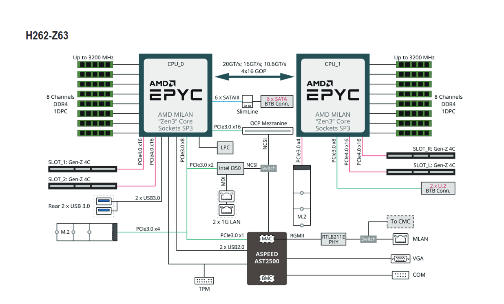

# Phoebe infrastructure

Phoebe supercomputer is placed in datacenter of Institute of Physics and infrastructure is managed with cooperation with [Computing centre (CC) of FZU.](https://www.farm.particle.cz/about/).

## Compute nodes (20×, n[1-20])

* Server/platform: Gigabyte H262-Z63 / Motherboard: MZ62-HD0-00 ([vendor link](https://www.gigabyte.com/Enterprise/High-Density-Server/H262-Z63-rev-100))
* CPU: 64 cores - 2x AMD EPYC 7543 ([vendor link](https://www.amd.com/en/products/processors/server/epyc/7003-series/amd-epyc-7543.html))
* Memory: 512 GB - 16ks 32GB Samsung DDR4 3200 MHz ECC M393A4K40EB3-CWE
* 100Gbit HPC interconnect adapter: single port Mellanox/Nvidia ConnectX 6 MT28908 Infiniband PCI-E card
* Ethernet adapter: dual-port 10Gbit Broadcom BCM57416 PCI-E card
* 1,92TB NVMe KINGSTON SEDC1500M1920G
* p~max~ = 360W / node

/// caption
Block diagram of a compute node (Gigabyte H262-Z63)
///

## GPU-accelerated compute nodes (2×, gpu[1-2])

* Server/platform: HPE ProLiant XL675d Gen10 Plus
* CPU: 64 cores - 2x AMD EPYC 7543 ([vendor link](https://www.amd.com/en/products/processors/server/epyc/7003-series/amd-epyc-7543.html))
* GPU: 8x NVIDIA A100-SXM with 80GB RAM connected with nvlink interconnect
* Memory: 2TB - 32ks 64GB SK Hynix DDR4 2933 MHz ECC HMAA8GR7AJR4N-XN
* 100Gbit HPC interconnect adapter: single port Mellanox/Nvidia ConnectX 6 MT28908 Infiniband PCI-E card
* Ethernet adapter: dual-port 10Gbit Marvell FastLinQ 41000 Series 
* 3.8TB NVMe HPE MZXL53T8HBLS-000H3
* p~max~ = 3.5 kW / node

## Fast sequential CPU nodes (2×, hv[1-2], a.k.a. ssh:phoebe.fzu.cz)

* Server/platform: Asus RS700A-E11-RS12U
* CPU: 32 cores up to 4GHz - 2x AMD EPYC 73F3 16-Core CPU ([vendor link](https://www.amd.com/en/products/processors/server/epyc/7003-series/amd-epyc-73f3.html))
* Memory: 512GB - 16ks 32GB SK Hynix DDR4  3200 MT/s ECC HMA84GR7DJR4N-XN
* p~max~ = 696 W
* also the hypervisors for the small nodes below

## Small nodes (3×, s[1-3])

* Platform: KVM virtual machines on the hv nodes
* CPU: 8 virtual cores of an AMD EPYC 73F3 ([vendor link](https://www.amd.com/en/products/processors/server/epyc/7003-series/amd-epyc-73f3.html))
* Memory: 64 GB
* No InfiniBand; local disk about 1 TB
* used by the `small_int` partition for light interactive work, and for software that runs
  better on a small machine than on a large SMP node, such as some legacy codes

## High speed interconnect network

* Infiniband MQM8700 Mellanox Quantum™ HDR Edge Switch ([vendor_link](https://network.nvidia.com/files/doc-2020/pb-qm8700.pdf))
* servers connected with bandwidth of 100Gbit using splitter cables 
* offers 40x200Gbit or 80x100Gbit port configuration, redundant PSU
* p~max~ = 189 W

## Ethernet network equipment

* Main switch: Alcatel-Lucent OmniSwitch OS6900-T48C6 (48× 10GBASE-T, 6× 100G QSFP28)
* every server is connected to it at 10 Gbit/s
* 100 Gbit link to a second OS6900-T48C6 in the Koios rack, which connects both clusters to the
  FZU computing centre network over two aggregated 10 Gbit links
* out-of-band management (IPMI): Cisco CBS350-24T-4G, 1 Gbit
* p~max~ = 132 W

## Storage infrastructure

218 TB of hybrid storage built from solid state and rotational drives holds software, user and
project data. See [storage](../storage.md) for how it is organised for users.

* Disk array: Infortrend EonStor DS3016RUE with dual RAID controllers and two JB 3016R
  expansion shelves (16 drive bays each)
* two storage servers `st1` and `st2`: Supermicro H12SSW-NT, 1× AMD EPYC 7302 (16 cores),
  128 GB RAM, ConnectX-6 HDR InfiniBand, 10 Gbit Ethernet
* both servers are attached to the array over 12 Gbit SAS and run as a Pacemaker high-availability
  pair
* [BeeGFS](https://www.beegfs.io/c/) parallel file system:
    * four storage targets of 55 TB each (XFS), two on each server
    * a metadata service on each server, on its own volume on the array
    * the management and monitoring services run on `st2`

## Power management

* five Raritan PX3 rack PDUs, managed over the network
* supplied by six single-phase 230 V / 32 A feeds (7.36 kW each), split into an A side and a
  B side
* servers with two power supplies take one from each side
