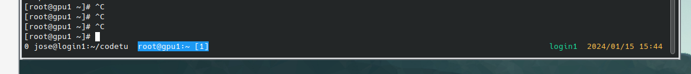

# Configuring screen for a tabbed view

## Configuring screen

Into `~/.screenrc` insert:

```shell
# Use bash
shell /bin/bash

autodetach on

# Big scrollback
defscrollback 5000

# No annoying startup message
startup_message off

# Display the status line at the bottom
hardstatus on
hardstatus alwayslastline
hardstatus string "%{.kW}%-w%{.bW}%t [%n]%{-}%+w %=%{..G} %H %{..Y} %Y/%m/%d %c"
```

In resulting look, you can see the status line containing open tabs, hostname and current time.


