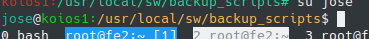

# Bash terminal tweaks

If not specified, following tweaks were meant to append to your `~/.bashrc` - a script that is executed whenever you start a new interactive instance of the Bash shell on Unix-like operating systems. The tilde `~` represents your home directory, so `~/.bashrc` refers to the `.bashrc` file in your home directory.

## Alias `showinclude`

Print gcc include dirs  (your dir with `.h` files should be there) 

```
alias showinclude='echo | gcc -E -Wp,-v -'
```

## Tweak bash history

By default, bash saves history on exit of shell. That leads to non-consistent history file. This tweak saves the history on every "Enter" key hit and increase bash history file size to 99999 lines.

```
export PROMPT_COMMAND='history -a'
HISTFILESIZE=99999
```

## More fancy prompt

Perhaps the default prompt is not fancy enough for you. This one is better - it shows your username, servername and directory path in different colors :)).

```
PS1="\[\033[36m\]\u\[\033[m\]@\[\033[32m\]\h:\[\033[33;1m\]\w\[\033[m\]\$ "
```



## Slurm shorthands

```
sacct_nice_format="jobid,User,jobname%22,partition,state,NNodes%5,NodeList,Start,End,Elapsed,UserCPU"
alias showmyjobs="sacct -a --user=${whoami} --format=${sacct_nice_format} --starttime=$(date --date='-1 month' +%Y-%m-%d)"
alias showalljobs="sacct -a --allusers --format=${sacct_nice_format} --starttime=$(date --date='-1 month' +%Y-%m-%d)"
alias si='sinfo -R -o "%25N %8u %21H %10t %E"'

```
