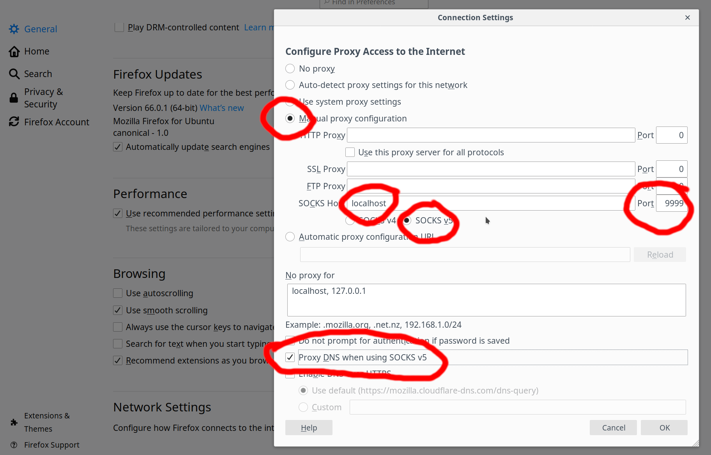
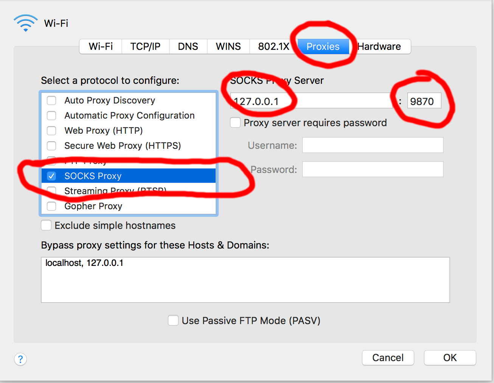

# Poor man's VPN over SSH

Using traffic tunneling over a SOCKS tunnel, especially through SSH, offers several benefits, like security, encryption and posibility to access services available from FZU internal networks only.

To configure Firefox to tunnel traffic over a SOCKS tunnel created by SSH, you can follow these steps:

## Create an SSH tunnel

Open a terminal or command prompt on your local machine and use the following command to create an SSH tunnel with dynamic port forwarding:

```bash
ssh -D 1080 user@limba.fzu.cz
```

Replace user with your main (email) institute username, log in with your Kerberos password.

## Configure Firefox

Open Firefox and follow these steps:

### Open the preferences
        
- On Windows and Linux, click on the three horizontal lines in the top-right corner, then select "Options."
- On macOS, click on "Firefox" in the menu bar, then select "Preferences."

### Go to network settings

- In the Preferences/Options page, select "General" on the left sidebar, scroll down to the "Network Settings" section.

### Configure proxy settings

- Click on the "Settings..." button next to "Connection."
- In the Connection Settings window, choose the "Manual proxy configuration" option

### Enter the SOCKS host

- In the "SOCKS Host" field, enter localhost as the host and `1080` as the port (or the port you specified in the SSH command).

### Select SOCKS v5

- Choose "SOCKS v5" as the type of proxy.

### Configure "No proxy for"

- You may want to add `localhost, 127.0.0.1` to the "No Proxy for" field to prevent the SSH tunnel itself from being proxied.

### Click OK

- Click "OK" to save the changes and close the Connection Settings window.

## Screenshot: Firefox



## System-wide configuration on macOS


